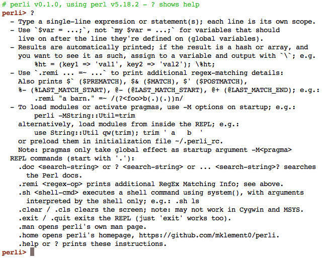
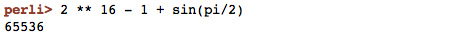
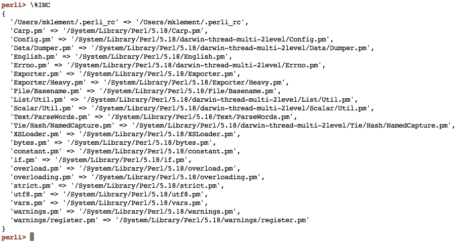
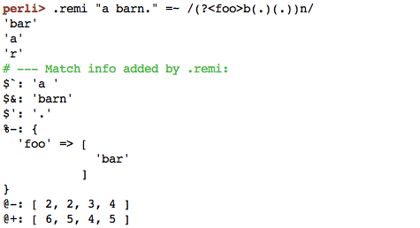
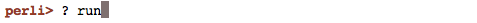
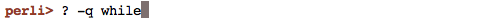

[](https://npmjs.com/package/perli) [](https://github.com/mklement0/perli/blob/master/LICENSE.md)

<!-- START doctoc generated TOC please keep comment here to allow auto update -->
<!-- DON'T EDIT THIS SECTION, INSTEAD RE-RUN doctoc TO UPDATE -->

**Contents**

- [perli &mdash; introduction](#perli-&mdash-introduction)
- [Examples](#examples)
  - [Startup and help](#startup-and-help)
  - [Automatic printing of results, use as a calculator](#automatic-printing-of-results-use-as-a-calculator)
  - [Inspecting a variable](#inspecting-a-variable)
  - [Inspecting regular-expression matches](#inspecting-regular-expression-matches)
  - [Looking up Perl documentation](#looking-up-perl-documentation)
- [Installation](#installation)
  - [Supported platforms and prerequisites](#supported-platforms-and-prerequisites)
  - [Installation from the npm registry](#installation-from-the-npm-registry)
  - [Manual installation](#manual-installation)
    - [Unix-like platforms](#unix-like-platforms)
    - [Windows](#windows)
- [Usage](#usage)
- [License](#license)
  - [Acknowledgements](#acknowledgements)
  - [npm dependencies](#npm-dependencies)
- [Changelog](#changelog)

<!-- END doctoc generated TOC please keep comment here to allow auto update -->

# perli &mdash; introduction

`perli` is a **multi-platform [Perl](https://www.perl.org/) [REPL (read-eval-print-loop)](http://en.wikipedia.org/wiki/Read%E2%80%93eval%E2%80%93print%20loop)**
for interactive experimentation with Perl code, convenient documentation lookups, and quick computations.

On Unix-like platforms, `perli` makes use of the [`rlwrap` utility](https://github.com/hanslub42/rlwrap) to provide
command-line editing support, persistent command history, and tab-completion;
see the [Installation](#installation) chapter below.

See the examples below, concise [usage information](#usage) further below,
or read the [manual](doc/perli.md).

# Examples

## Startup and help

Once you enter `perli`, use `?` for help.



## Automatic printing of results, use as a calculator

Results of expressions are automatically printed, which makes `perli` handy
as an interactive calculator:



Results are printed with the `Data::Dumper` core Perl module, which means
that they are reusable as input.

## Inspecting a variable

The following example inspects the special `%INC` variable, which contains the
list of loaded modules. Note the first entry, which is `perli`'s own (optional)
initialization file.

The `\` prefix here is not strictly necessary, but ensures that the hashtable is
printed in prettier form.



## Inspecting regular-expression matches

`perli` provides the `.remi` (for *r*egular-*e*xpression *m*atch *i*nfo)
command, which, in addition to an expression's own result, prints the values
of the special variables that Perl maintains about the most recent successful
regex match:



## Looking up Perl documentation

Invoking documentation overlays the REPL temporarily, as a `man` page would
(not shown here).

By default, `perli` tries to guess the _type_ of the element to look up, and
invokes `perldoc` behind the scenes accordingly.

* Prefix form

The following is the equivalent of `perldoc perlrun`:



* Postfix form

This form is handy for lookups while you're in the middle of typing an expression.

The following is the equivalen of `perldoc -f split`:


* Explicit-options form

If the "fuzzy" default lookup doesn't find anything, or shows the wrong page,
you can use the prefix form with explicit `perldoc` options.

The following example searches the FAQs (`-q`) for the term `while` (the default
lookup would have looked for the _keyword_).




# Installation

## Supported platforms and prerequisites

`perli` runs on **Linux**, **OSX**, and **Windows**, with **Perl v5.6.2 or higher** installed.

Using the manual installation process detailed below, `perli` may work on other Unix-like platforms too.

On Unix-like platforms, `perli` makes use of the `rlwrap` utility, if present,  
to provide command-line editing support, persistent command history,  
and simple tab completion.

On Windows, `rlwrap` is not available, unfortunately, but you do get  
in-session history and basic command-line editing out of the box (but no
tab-completion).

You can install `rlwrap` as follows:

* Debian-based Linux distros such as Ubuntu:

        sudo apt-get install rlwrap

* Fedora:

        sudo yum install rlwrap

* OSX, via [Homebrew](http://brew.sh):

        brew install rlwrap

* Unix-emulation environments for Windows:

    * Cygwin (Windows):

         Re-run Cygwin's `setup*.exe` and install
         `Utils` > `rlwrap and Base` > `libreadline*`

    * MSYS / MinGW / Git Bash (Windows):

         Sadly, `rlwrap` is not offered. The next best thing is to use a
         native Windows Perl version, with which you get at least basic command-line
         editing and in-session history:
         Deactivate the Unix Perl with `mv /bin/perl /bin/perl.inactive`
         and install [Strawberry Perl](http://strawberryperl.com/)

* All others: see [`rlwrap`'s homepage](https://github.com/hanslub42/rlwrap)


## Installation from the npm registry

<sup>Note: Even if you don't use Node.js, its package manager, `npm`, works across platforms and is easy to install; try [`curl -L http://git.io/n-install | bash`](https://github.com/mklement0/n-install)</sup>

With [Node.js](http://nodejs.org/) or [io.js](https://iojs.org/) installed, install [the package](https://www.npmjs.com/package/perli) as follows:

    [sudo] npm install perli -g

**Note**:

* Whether you need `sudo` depends on how you installed Node.js / io.js and whether you've [changed permissions later](https://docs.npmjs.com/getting-started/fixing-npm-permissions); if you get an `EACCES` error, try again with `sudo`.
* The `-g` ensures [_global_ installation](https://docs.npmjs.com/getting-started/installing-npm-packages-globally) and is needed to put `perli` in your system's `$PATH`.

## Manual installation

### Unix-like platforms

* Download [the CLI](https://raw.githubusercontent.com/mklement0/perli/stable/bin/perli) as `perli`.
* Make it executable with `chmod +x perli`.
* Move it or symlink it to a folder in your `$PATH`, such as `/usr/local/bin` (OSX) or `/usr/bin` (Linux).

### Windows

* Download [the CLI](https://raw.githubusercontent.com/mklement0/perli/stable/bin/perli) as `perli.pl`.
* Either move `perli.pl` itself into a folder in your `%PATH%`, or write a 
wrapper batch file named `perli.cmd` that invokes it.

# Usage

Find brief usage information below; for complete documentation, once installed, run `man perli` (`perli --man` on Windows and if installed manually), or read the [manual online](doc/perli.md).

<!-- DO NOT EDIT THE FENCED CODE BLOCK and RETAIN THIS COMMENT: The fenced code block below is updated by `make update-readme/release` with CLI usage information. -->

```nohighlight
$ perli --help


A simple, convenient Perl REPL for interactive experimentation.

    perli [<options>]

    --norc      skips loading of the initialization file

    The following Perl options are also supported:

    -M<name>    (repeatable) load a module and import its defaults,  
                             or activate a pragma (-M-<name> deactivates)
    -m<module>  (repeatable) load a module without importing
    -I<dir>     (repeatable) prepend <dir> to module search path (@INC)

Initialization file is ~/.perli_rc

Standard options: --help, --man, --version, --home
```

<!-- DO NOT EDIT THE NEXT CHAPTER and RETAIN THIS COMMENT: The next chapter is updated by `make update-readme/release` with the contents of 'LICENSE.md'. ALSO, LEAVE AT LEAST 1 BLANK LINE AFTER THIS COMMENT. -->

# License

Copyright (c) 2015 Michael Klement <mklement0@gmail.com> (http://same2u.net), released under the [MIT license](https://spdx.org/licenses/MIT#licenseText).

## Acknowledgements

This project gratefully depends on the following open-source components, according to the terms of their respective licenses.

[npm](https://www.npmjs.com/) dependencies below have optional suffixes denoting the type of dependency; the *absence* of a suffix denotes a required *run-time* dependency: `(D)` denotes a *development-time-only* dependency, `(O)` an *optional* dependency, and `(P)` a *peer* dependency.

<!-- DO NOT EDIT THE NEXT CHAPTER and RETAIN THIS COMMENT: The next chapter is updated by `make update-readme/release` with the dependencies from 'package.json'. ALSO, LEAVE AT LEAST 1 BLANK LINE AFTER THIS COMMENT. -->

## npm dependencies

* [doctoc (D)](https://github.com/thlorenz/doctoc)
* [json (D)](https://github.com/trentm/json)
* [marked-man (D)](https://github.com/kapouer/marked-man#readme)
* [replace (D)](https://github.com/harthur/replace)
* [semver (D)](https://github.com/npm/node-semver#readme)
* [tap (D)](https://github.com/isaacs/node-tap#readme)
* [urchin (D)](https://github.com/tlevine/urchin)

<!-- DO NOT EDIT THE NEXT CHAPTER and RETAIN THIS COMMENT: The next chapter is updated by `make update-readme/release` with the contents of 'CHANGELOG.md'. ALSO, LEAVE AT LEAST 1 BLANK LINE AFTER THIS COMMENT. -->

# Changelog

Versioning complies with [semantic versioning (semver)](http://semver.org/).

<!-- NOTE: An entry template for a new version is automatically added each time `make version` is called. Fill in changes afterwards. -->

* **[v0.1.2](https://github.com/mklement0/perli/compare/v0.1.1...v0.1.2)** (2015-09-30):
  * [fix] Fixed inability to define global variables (without `my`) in older Perl versions (e.g., v5.14).

* **[v0.1.1](https://github.com/mklement0/perli/compare/v0.1.0...v0.1.1)** (2015-09-24):
  * Project-status corrected in read-me.

* **v0.1.0** (2015-09-24):
  * Initial release.
